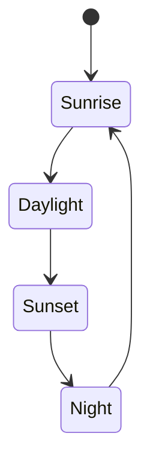

# Time

Time flows tick-by-tick in Thedes. It can be understood by views:
- Linear time of the day
- Part of the day
- Day within the current season
- Season
- Day within the current year
- Year
- Days since the player entered the world
- Lunar phase
- Month

After the player enters in a world, such world will end in 270 days
and the player will die with it, unless the player jumps into a no-return door.
If the door is crossed, the player enters in a new world reseting the counter,
being able to bring only the items in the player's inventory.

There are eight lunar phases:
- New (first phase)
- Waxing crescent
- First quarter
- Waxing gibbous
- Full
- Waning gibbous
- Last quarter
- Waning crescent

Each lunar phase lasts only one day.
A month starts at the day whose lunar phase is "new",
and ends at the day whose lunar phase is "waxing crescent";
thus, a month lasts 8 days.

Also, there are four seasons:
- Ware (14 days, first season)
- Summer (13 days)
- Harvest (14 days)
- Winter (13 days)

And there are four parts of the day:
- Sunrise (first part)
- Daylight
- Sunset
- Night

Intra-day, there is a linear time progression, but shifts from one part of the
day to another is not linear.
Each part of the day might last a different total time.
In fact, the duration of each part of the day is not constant,
it depends on the day of the year.

## Cycle: Part of the Day

